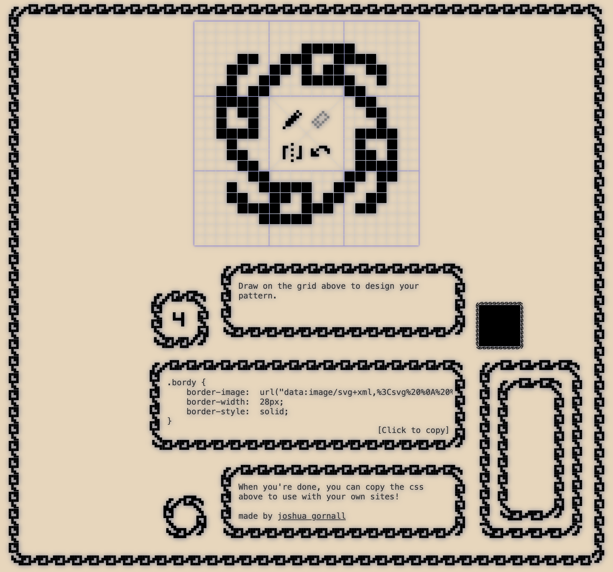

# Bordy - The Border Beautifier 🎨

Welcome to **Bordy**! say goodbye to boring edges and hello to pixel-perfect panache. 🚀

## What's Bordy?

A creative playground to bring borders to life, one pixel at a time.

## Features

- **9x9 Grid of Greatness**: A grid so fine, it makes Tic-Tac-Toe jealous.
- **Undo Button**: Made a mistake? Never happened. the undo button covers your tracks like a pro.
- **Symmetry Lock**: Because what's a left without a right? Or an up without a down? Symmetry is not just beautiful, it's Bordy-ful.
- **CSS Border-Image Wizardry**: Dive into the rarely-trodden path of CSS’s `border-image` property.

## How Bordy Works (The Secret Sauce)

Here’s the deal: Bordy transforms your artistic expressions into a base64 encoded masterpiece, snugly fitting in your CSS.

### No Extra Baggage

Forget additional assets; Bordy's like a self-contained Swiss army knife. It packs everything into a neat base64 format. Copy, paste, and watch the magic unfold. No dragons here, just pure CSS wizardry.

## Get Started (Unleash Your Inner Border Artist)

1. **Clone the Repository (Summon Bordy)**
   ```bash
   git clone https://github.com/joshuagornall/bordy.git
   ```
2. **Enter the Bordy Realm**
   ```bash
   cd bordy
   ```
3. **Awaken the Dependencies**
   ```bash
   npm install
   ```
4. **Bring Bordy to Life**
   ```bash
   npm start
   ```

## Contributing

Got ideas to make Bordy even more awesome? Bugs to squash? Or just want to say hi? Jump in and submit a pull request.

## License

Bordy is unleashed upon the world under the [MIT License](LICENSE).

## Acknowledgments

Big thanks to the border fanatics and pixel perfectionists. You inspire us to push the boundaries (pun intended). 🎩

Happy designing, folks! Brought to you by the whimsical world of Joshua Gornall.


